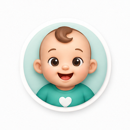
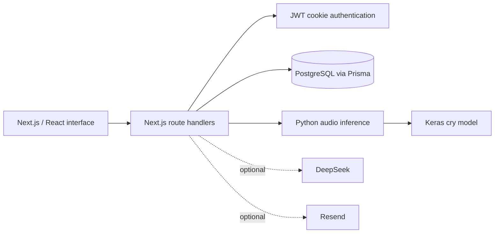

<div align="center">



# Baby Care · SuperMamy

### An Arabic-first companion for everyday baby care

Cry analysis · Family profiles · Care timelines · Reports


**اسمعي · افهمي · تابعي · شاركي**

[Getting started](#getting-started) · [Detailed technical guide](docs/TECHNICAL_GUIDE.md) · [Model & API reference](docs/IMPLEMENTATION_REFERENCE.md) · [العربية](docs/README.ar.md) · [Security](SECURITY.md)

</div>

Baby Care brings child profiles, daily care records, reminders, and audio analysis into one Arabic-first web application. It helps caregivers organize observations and prepare a clearer report for a doctor.

> Educational project. Audio labels and risk scores are model/rule outputs, not a diagnosis. No clinical validation or model accuracy benchmark is claimed in this repository.

## Features

| Area | Implemented capabilities |
| --- | --- |
| Family profiles | Multiple child profiles and child-scoped conversations |
| Cry analysis | Python/Keras inference with confidence and uncertainty handling |
| Everyday care | Feeding and sleep records, growth, vaccinations, medications and doses |
| Care timeline | A chronological record of observations and care events |
| Guidance | Arabic chat interface, rule-based guidance and optional DeepSeek integration |
| Reminders | In-app reminders and optional Resend email delivery |
| Reports | Care summaries and token-based report sharing |
| Interface | Arabic presentation, responsive layouts and animated landing page |

## Architecture

For the full English explanation, read the [technical guide](docs/TECHNICAL_GUIDE.md): audio decoding, mel/MFCC/delta features, augmentation, the exact MobileNetV2 head, saved optimizer configuration, uncertainty thresholds, risk rules, chat, authentication, database, and deployment. The [generated reference](docs/IMPLEMENTATION_REFERENCE.md) lists all model layers, their saved settings, API methods, and database fields.

The actual model uses MobileNetV2 followed by global average pooling, Dense(384), batch normalization, Dropout(0.4), Dense(192), batch normalization, Dropout(0.25), and a five-class softmax. Saved augmentation layers include feature-space GaussianNoise(0.01) and RandomTranslation(0.03, 0.06). Historical presentation claims about other augmentation methods and accuracy are explicitly distinguished from verified artifact facts in the guide.



## Getting started

Requirements: Node.js 22 LTS, npm, PostgreSQL, and Python 3.10 for the pinned ML environment. Use a new local database, never a production database for development.

### 1. Configure the web app

```bash
cd frontend
npm ci
cp .env.example .env
openssl rand -hex 32
```

Set `DATABASE_URL` to your local database and paste the generated value into `AUTH_SECRET` in `.env`. Optional integration keys may remain empty.

```bash
npx prisma generate
npx prisma migrate deploy
npm run dev
```

Open **http://localhost:3000**, register a local account, and create a child profile. The repository includes schema migrations, not user data.

### 2. Enable cry analysis

From the repository root:

```bash
python3.10 -m venv ml/.venv
ml/.venv/bin/python -m pip install -r ml/requirements.txt
```

The model lives at `ml/models/best_model.keras`. `PYTHON_BIN` in `frontend/.env` must point to your ML interpreter. On Windows use `../ml/.venv/Scripts/python.exe`.

The inference pipeline processes the first three seconds at 22,050 Hz, padding shorter input, and combines mel spectrogram, MFCC/delta, and mel-delta features into a `(128, 128, 3)` input. It does not scan multiple windows. The configured label order must match the trained model. See [model notes](ml/MODEL.md).

For compressed audio formats, install FFmpeg and optional `pydub` in the same Python environment. The application does not silently substitute model output when inference fails by default.

### 3. Validate and build

```bash
cd frontend
npm run lint
npx tsc --noEmit
npm run build
npm start
```

## Repository layout

```text
frontend/
  src/app/          Pages and API routes
  src/components/  UI and landing-page components
  src/lib/         Authentication, care logic and services
  prisma/          Database schema and migrations
  public/          UI illustrations and icons
  scripts/         Audio inference and local database backup
ml/
  models/          Keras model artifact
  requirements.txt Python dependencies
  MODEL.md         Input contract and model limitations
docs/              Architecture and Arabic overview
```

## Optional services and deployment

DeepSeek chat requires `DEEPSEEK_API_KEY`. Email requires `RESEND_API_KEY` and `NOTIFICATION_EMAIL_FROM`. Missing provider credentials leave those integrations unconfigured; core data management can run locally.

Deploy the application with a Node.js server, PostgreSQL, and a Python interpreter that can access the model. Configure secrets through the hosting environment, use HTTPS, and keep database backups outside version control. Static export alone cannot run the API or Python inference.

## Project status

The source includes a trained model but no training dataset, training notebook, or independent evaluation report. Real recordings, production settings, database backups, internal presentations, and runtime logs are excluded from this repository. No reuse license is granted yet; choose one after confirming ownership of the code, assets, and model.
