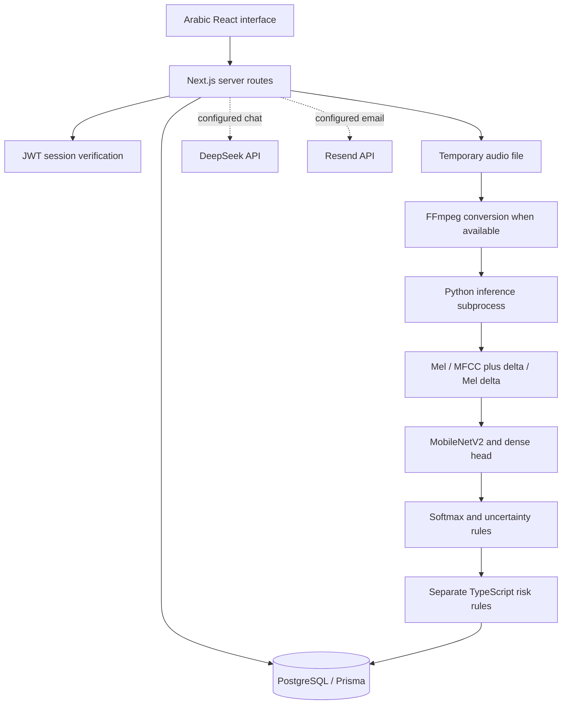

# Baby Care / SuperMamy — Detailed Technical Guide

This guide explains the supplied implementation, including the audio representation, augmentation configuration, neural network, saved training configuration, inference decisions, web application, database, and operating requirements. It distinguishes facts recovered from source code and the model artifact from training claims that cannot currently be reproduced.

## Contents

1. [System overview](#system-overview)
2. [Audio preprocessing](#audio-preprocessing)
3. [Feature extraction](#feature-extraction)
4. [Augmentation](#augmentation)
5. [Model architecture](#model-architecture)
6. [Training configuration and evidence](#training-configuration-and-evidence)
7. [Prediction and uncertainty](#prediction-and-uncertainty)
8. [Request lifecycle](#request-lifecycle)
9. [Risk scoring](#risk-scoring)
10. [Chat and external services](#chat-and-external-services)
11. [Accounts and data](#accounts-and-data)
12. [Configuration and operation](#configuration-and-operation)
13. [Reproducibility and limitations](#reproducibility-and-limitations)

The [generated reference](IMPLEMENTATION_REFERENCE.md) contains every saved model layer and its settings, graph call arguments, optimizer configuration, API method inventory, database field definitions, and declared dependency versions. The [artifact inspection script](../ml/inspect_artifact.py) regenerates that reference without importing TensorFlow or running the model.

## System overview

Baby Care is an Arabic-first baby-care web application. The UI supports child profiles, conversations, uploaded or recorded audio, care records, growth measurements, vaccinations, medications, reminders, timelines, and shareable reports. “SuperMamy” is the name used in the interface and assistant prompt.

The application has three distinct decision systems:

| System | Inputs | Implementation | Outputs |
| --- | --- | --- | --- |
| Cry classifier | Three-channel audio feature tensor | Keras MobileNetV2 backbone and classification head | Five softmax scores |
| Risk assessment | Text, age, optional observations, cry label | TypeScript additive rules | Score, severity, triage, reasons and actions |
| Chat guidance | Message history, text topics, latest audio result | Local rules, grounded replies, optional DeepSeek | Conversational text |

The application combines these outputs. The neural network itself does not accept temperature, age, diaper counts, text, or medical records. Therefore, the end-to-end application combines multiple inputs, but the saved neural model is an audio-feature classifier, not a jointly trained multimodal clinical model.



## Audio preprocessing

Source: [infer_cry.py](../frontend/scripts/infer_cry.py), with server-side conversion in [the analysis route](../frontend/src/app/api/analyze/route.ts).

### Decoding and conversion

The API saves the upload under `frontend/tmp/` using a random UUID and a sanitized extension. It attempts FFmpeg conversion to a mono WAV at 22,050 samples per second, limited to the first three seconds. This conversion has a 25-second timeout. If it fails, inference receives the original file instead.

Python first reads the file with `soundfile.read(..., dtype="float32")`. If decoding fails and pydub is available, it uses pydub, requests mono audio at 22,050 Hz, converts samples to floating point, and divides by `2**15`. That divisor assumes a 16-bit amplitude scale; the fallback does not explicitly force a sample width, so differently encoded inputs need testing. FFmpeg WAV normalization reduces dependence on this fallback.

For multichannel data returned by soundfile, the script takes the arithmetic mean across channels. If the sample rate differs from 22,050 Hz, it calls `librosa.resample`. Resampling changes the sampling grid; it is not pitch-shift augmentation.

### Silence gate and duration

Before feature extraction, empty audio or a waveform with `max(abs(y)) < 0.005` receives `background`, confidence `1.0`, and signal quality `low`. This is an amplitude rule, not a measured 100% neural-network probability. The model is loaded before this check, so silence still requires a loadable model file.

For other audio, `librosa.util.fix_length` sets the waveform length to `3 × 22050 = 66,150` samples. Long input is truncated; short input is zero-padded. Only one segment is classified. There is no sliding-window search, loudest-cry selection, or averaging of predictions across a long recording.

The implementation does not apply waveform peak normalization, loudness normalization, denoising, voice-activity detection, or a learned cry detector before the feature pipeline. Feature normalization described below is a separate operation.

## Feature extraction

Each segment becomes a floating-point array of shape `(128, 128, 3)`, then receives a batch dimension to form `(1, 128, 128, 3)`. The channels are numerical acoustic features, not RGB colors. Rows have different meanings across channels; columns represent successive time frames.

### Channel 1: normalized log-mel power spectrogram

The explicit call is:

```python
mels = librosa.feature.melspectrogram(
    y=segment, sr=22050, n_mels=128, fmax=8000
)
mels_db = librosa.power_to_db(mels, ref=np.max)
```

Mel bands summarize energy across frequency regions. Power is converted to decibels relative to the maximum in that segment. The script inherits other spectral parameters from librosa rather than specifying them itself. The installed 0.10.0 implementation uses the standard 2,048-point FFT and 512-sample hop defaults; the Hann window, centering, and padding behavior also matter when reproducing the input.

The matrix is padded with zero-valued columns if needed, then cropped to its first 128 columns. For the standard centered transform of 66,150 samples with hop 512, there are 130 frames before cropping. The waveform therefore spans three seconds, but the final representation retains only 128 spectral frames.

Normalization is computed over the whole channel:

```text
normalized = (X - min(X)) / (max(X) - min(X) + 0.000001)
```

This places values approximately in `[0, 1]` and avoids division by zero. It is per-example, per-channel scaling, not normalization using training-set statistics. Padding a decibel matrix with zero also deserves attention: zero dB represents the reference maximum, not silent energy.

### Channel 2: MFCCs stacked with their temporal deltas

The script independently computes 64 MFCC coefficients from the waveform:

```python
mfcc = librosa.feature.mfcc(y=segment, sr=22050, n_mfcc=64)
mfcc_delta = librosa.feature.delta(mfcc)
m2_raw = np.vstack([mfcc, mfcc_delta])
```

Rows 0–63 contain MFCC coefficients; rows 64–127 contain their first temporal derivatives. MFCCs compactly describe the spectral envelope. Their deltas describe how coefficients change across frames. This is not a second-order delta or delta-delta representation.

This call does not reuse Channel 1's mel matrix and does not explicitly set `fmax=8000`. Matching it to Channel 1 by rewriting it to reuse that matrix would change the model input. The result is independently padded/cropped to 128 columns and normalized using its own minimum and maximum.

### Channel 3: temporal delta of the log-mel matrix

The script computes `librosa.feature.delta(mels_db)` after the Channel 1 decibel matrix has already been padded/cropped. It normalizes the resulting delta matrix independently. This captures changes in the mel representation across time. The default derivative operates along the final time axis; it is not differentiation across frequency bins.

Finally, `np.stack([m1, m2, m3], axis=-1)` combines the channels. Changes to sample rate, duration, feature order, MFCC count, delta settings, normalization, or label order alter the model's input/output contract.

For library semantics, see the official [librosa mel-spectrogram reference](https://librosa.org/doc/0.10.2/generated/librosa.feature.melspectrogram.html) and [feature reference](https://librosa.org/doc/0.10.2/feature.html). These linked references describe 0.10.2; the repository pins 0.10.0, so reproducibility should use that pinned implementation rather than silently upgrading.

## Augmentation

Augmentation means constructing altered training examples to expose a model to controlled variation. A saved model can reveal augmentation layers inside its graph; it cannot reveal all transformations that may have been performed by an external training data loader.

### Augmentation verified inside the model artifact

| Layer | Exact saved settings | Domain |
| --- | --- | --- |
| `GaussianNoise` | `stddev=0.01`, `seed=null` | Three-channel feature tensor |
| `RandomTranslation` | `height_factor=0.03`, `width_factor=0.06`, `fill_mode="nearest"`, `interpolation="bilinear"`, `fill_value=0.0`, `seed=null`, channels last | Three-channel feature tensor |

Gaussian noise perturbs feature values, when active, using zero-centered random noise with standard deviation 0.01. It is distinct from adding noise to the original waveform. [Keras GaussianNoise documentation](https://keras.io/api/layers/regularization_layers/gaussian_noise/) explains its training/inference behavior.

Translation shifts the tensor vertically by up to about 3.84 rows and horizontally by up to about 7.68 columns. Horizontal movement shifts time. Vertical movement shifts feature rows: it is not a physically exact pitch shift, particularly because Channel 2 combines MFCC coefficients and their derivatives. Bilinear interpolation allows fractional shifts, and nearest fill extends edge values. `fill_value` is saved but is not the fill mechanism when `fill_mode` is `nearest`. See [Keras RandomTranslation documentation](https://keras.io/api/layers/preprocessing_layers/image_augmentation/random_translation/).

The graph saves call arguments as well as layer settings. Its stored calls include `GaussianNoise(training=false)`, `RandomTranslation(training=true)`, `MobileNetV2(training=false)`, and both Dropout calls with `training=false`. These are not a record of the entire training loop. The effective behavior also depends on the outer model's `training` argument and Keras version. Consequently, the existence of an augmentation layer does not establish that it was active throughout training, and the serialized `training=true` value alone does not prove augmentation runs during `predict`. Runtime observations are recorded in [validation](VALIDATION.md).

### Augmentation claimed in an older presentation, but not reproducible here

A local presentation-generation source describes the following techniques. No executable training notebook, dataset manifest, or transformation log was supplied to verify their use for this checkpoint:

| Presentation claim | What the technique would do | Evidence status |
| --- | --- | --- |
| Pitch shift by ±2 semitones | Shift waveform pitch | Not found in the supplied inference code or saved augmentation graph |
| Time stretch at rates 0.85–1.15 | Change duration while attempting to preserve pitch | Not found in supplied executable training code |
| Waveform Gaussian noise, sigma 0.005 | Add random waveform noise | Different from the verified feature-noise layer with sigma 0.01 |
| Time masking, 0–20 frames | Hide selected spectrogram time columns | Not found in the saved model graph |
| Frequency masking, 0–10 bins | Hide selected frequency rows | Not found in the saved model graph |
| Tenfold expansion, approximately 2,595 to 25,950 samples | Generate multiple variants per source sample | No manifest or training log to verify counts |
| SMOTE and balanced class weights | Synthetic feature-space samples and weighted losses | Installed packages and slides do not establish actual execution |

These claims may describe a separate experiment or an intended pipeline. They must not be presented as verified methods or results of this artifact. In particular, the presentation also describes a classification head that differs from the actual file.

For a future reproducible training run, split by infant or original recording before augmentation, apply stochastic transformations only to training examples, and keep validation/test recordings independent. Augmenting before splitting can place near-duplicates in both training and evaluation sets. This paragraph describes an evaluation requirement, not a completed procedure in this repository.

## Model architecture

The supplied `best_model.keras` is a Keras Functional model. Its metadata records Keras **3.13.2** and save time **2026-03-09@07:49:49** with no timezone specified. The deployment requirements separately pin TensorFlow 2.17.1 and Keras 3.12.2. A save timestamp does not establish when or how long training ran.

Artifact SHA-256:

```text
c83a485673c631547b4084412f92189694dbde6986597501b8ade3b2ae92be09
```

### Full outer architecture

| Order | Layer | Output excluding batch | Settings |
| --- | --- | --- | --- |
| 1 | Input | 128 × 128 × 3 | float32 |
| 2 | GaussianNoise | 128 × 128 × 3 | stddev 0.01 |
| 3 | RandomTranslation | 128 × 128 × 3 | height 0.03; width 0.06 |
| 4 | Rescaling | 128 × 128 × 3 | `2*x - 1` |
| 5 | MobileNetV2 | 4 × 4 × 1280 | `mobilenetv2_1.00_128` |
| 6 | GlobalAveragePooling2D | 1280 | Average each feature map across its spatial dimensions |
| 7 | Dense | 384 | ReLU, bias, L2 kernel penalty 0.0001 |
| 8 | BatchNormalization | 384 | momentum 0.99, epsilon 0.001 |
| 9 | Dropout | 384 | rate 0.40 |
| 10 | Dense | 192 | ReLU, bias, L2 kernel penalty 0.0001 |
| 11 | BatchNormalization | 192 | momentum 0.99, epsilon 0.001 |
| 12 | Dropout | 192 | rate 0.25 |
| 13 | Dense | 5 | Softmax, bias, no kernel regularizer |

Rescaling converts approximately `[0,1]` inputs to `[-1,1]`; there is no extra 1/255 division in the inference script. MobileNetV2 contains depthwise convolutions, pointwise projections, expansion layers, batch normalization, ReLU6 activations, and residual additions. The reference appendix lists all 154 internal layers rather than substituting a generic MobileNet classifier description.

Global averaging turns the 4 × 4 × 1280 feature map into a 1,280-element vector. The two dense layers learn combinations of those features. ReLU retains positive activations. The L2 regularizers add `0.0001 * sum(kernel**2)` for each of the two hidden dense kernels to the training objective. Dropout rates describe random masking when training behavior is active; they do not reduce the permanent number of neurons.

Loading the supplied artifact in TensorFlow 2.17.1 / Keras 3.12.2 gives **2,827,077 total parameters**, with **2,291,781 trainable** and **535,296 non-trainable**. The backbone contributes 2,257,984 parameters. The head contributes 569,093: 491,904 in the first Dense layer, 1,536 in its BatchNormalization, 73,920 in the second Dense layer, 768 in its BatchNormalization, and 965 in the output Dense layer. Normalization parameter totals include moving statistics. Optimizer state contributes archive storage but is not counted as model parameters.

For output logits `z`, softmax computes `p_i = exp(z_i) / sum_j exp(z_j)`. The largest score supplies the nearest class, subject to the postprocessing rules below. Softmax scores are not established probabilities of a baby's physiological condition without calibration and suitable validation.

### Trainable state and transfer learning

The saved backbone contains 154 layers. Its saved flags mark 30 layers trainable and 124 non-trainable, including layers without weights. The first trainable backbone layer is index 109, `block_12_expand_relu`; subsequent trainable weighted layers begin with `block_12_depthwise`. All backbone BatchNormalization layers are non-trainable. The entire outer classification head is marked trainable.

These settings are consistent with partial backbone fine-tuning. They do not prove ImageNet initialization, the order of freezing/unfreezing stages, the original optimizer schedule, or the number of epochs. In particular, “100 frozen plus 54 fine-tuned layers” from the older presentation does not match the saved flags.

## Training configuration and evidence

The archive includes a compile configuration, even though inference loads it with `compile=False`:

| Setting | Saved value |
| --- | --- |
| Optimizer | Adam |
| Saved learning rate | approximately 0.00000125 |
| beta_1 / beta_2 | 0.9 / 0.999 |
| epsilon | 0.0000001 |
| AMSGrad | false |
| Weight decay | null |
| clipnorm / global_clipnorm / clipvalue | null / null / null |
| EMA | disabled |
| Gradient accumulation steps | null |
| Loss | sparse categorical cross-entropy |
| Metric configured | accuracy |
| Weighted metrics / loss weights | null / null |
| run_eagerly / jit_compile | false / false |
| steps_per_execution | 1 |

Sparse categorical cross-entropy expects integer class IDs. For the true class `y`, its main classification term is `-log(p_y)`, together with applicable regularization losses during training. Configuring an accuracy metric does not preserve or prove an achieved accuracy value.

The saved learning rate is a checkpoint value. It must not be described as the initial learning rate. No scheduler history can be reconstructed from that single number.

The available files do not establish dataset licenses, recording consent, infant identities, class counts, split membership, random seeds, batch size, epoch count, callback configuration, training hardware, or held-out performance. The older presentation claims batch size 32, up to 100 epochs, an 80/10/10 split, callbacks, and 92.5% accuracy; no accompanying training run or evaluation artifact verifies those claims. It also alternates between describing that accuracy as validation and test accuracy. This documentation therefore does not publish it as a benchmark.

## Prediction and uncertainty

Default index mapping:

| Index | Label | Application interpretation |
| --- | --- | --- |
| 0 | background | Background/no clear cry |
| 1 | belly_pain | Pattern associated with abdominal discomfort |
| 2 | discomfort | General discomfort pattern |
| 3 | hungry | Hunger-associated pattern |
| 4 | tired | Tiredness-associated pattern |

This order comes from application configuration, not a recovered training label encoder. `MODEL_LABELS` overrides it; otherwise `PREDICTION_LABELS` may override it, then the hard-coded list is used. The script checks that the number of labels equals the number of model outputs. That catches a length mismatch, but not an incorrect permutation.

`uncertain` is a postprocessing label, not a sixth output neuron. `burping` appears in the UI label dictionary, but is not one of the default five outputs.

For non-silent input, the script obtains one score vector, chooses its argmax, and returns the top three labels with scores rounded to four decimal places. It computes the top-two difference before rounding.

| Setting | Script default | Example environment |
| --- | --- | --- |
| `PREDICTION_CONFIDENCE_THRESHOLD` | 0.45 | 0.60 |
| `PREDICTION_UNCERTAIN_FLOOR` | 0.32 | 0.32 |
| `PREDICTION_AMBIGUITY_MARGIN` | 0.08 | 0.08 |

The script sets `signal_quality="good"` only when the largest score is at least the confidence threshold and the top-two difference is at least the ambiguity margin. Otherwise it uses `low_confidence`. A non-background winning class becomes `uncertain` only when its score is strictly below the uncertainty floor. Ambiguity alone does not replace a label with `uncertain`.

For example, a largest score of 0.58 is below the example configuration's 0.60 quality threshold but above the 0.32 uncertainty floor. Its class is retained with a low-confidence flag. A score of 0.70 against a runner-up of 0.65 is also low confidence because their difference is below 0.08.

The `signal_quality` field mostly describes confidence and class ambiguity, not measured signal-to-noise ratio. Confidence-based uncertainty handling does not itself establish model accuracy.

The Python JSON fields are `predicted_class`, `confidence`, `advice`, `signal_quality`, and `top_predictions`. Advice is selected from a fixed class dictionary, with additional text for uncertain or low-confidence cases.

## Request lifecycle

`POST /api/analyze` accepts multipart form data. Required field: `audio`. Other fields: `message`, `conversationId`, `temperatureC`, `wetDiapers24h`, `cryingHours`, `poorFeeding`, and `sleepIssue`.

1. Verify the authenticated user and resolve the active baby profile.
2. Parse observations. Temperature accepts 30–45, diaper count 0–30, crying hours 0–24. Invalid or missing numeric entries become null. Boolean fields are true only for the string `"true"`.
3. Require an uploaded `File`; otherwise return HTTP 400.
4. Save the temporary file, attempt FFmpeg conversion, and locate Python.
5. Check candidates in order: `PYTHON_BIN`, `python3`, `python`. A successful `--version` check establishes interpreter availability, not the availability of TensorFlow or other packages.
6. Start `scripts/infer_cry.py` with a 60-second timeout and 1 MiB output buffer. Each request creates a fresh process and loads the model anew.
7. Parse the last stdout line resembling a JSON object and validate the result with Zod. Confidence must be between 0 and 1.
8. Run the separate risk engine and assemble an Arabic response with label meaning, confidence, guidance, observations, and explanations.
9. Reuse a conversation only if its ID, user ID, and baby profile match. Otherwise create one.
10. In a transaction, store the user and assistant messages, update the conversation timestamp, and create an app reminder due two hours later.
11. Create cry-analysis and reminder-created timeline events, including inference and risk metadata.
12. Return the conversation ID and enriched result, then remove temporary input/output files in `finally`.

Timeline writes occur outside the message/reminder transaction. A later failure can leave earlier writes committed. A forced process termination can also bypass ordinary cleanup; the temporary directory is not a permanent recording store.

The response includes `analysisEngine="model"` or `"heuristic-fallback"`. By default, model failure returns HTTP 503 with `AUDIO_MODEL_UNAVAILABLE`. The configured default is not to invent a replacement model result.

If `AUDIO_MODEL_FALLBACK_MODE` explicitly enables fallback, the route matches keywords in the user's text, not the audio. It returns fixed scores: belly pain 0.64, hungry 0.62, tired 0.61, discomfort 0.60, or uncertain 0.48 without a match. These constants and auxiliary scores are not a calibrated probability distribution and should not be used as model evaluation data.

The Keras loader first tries `load_model(..., compile=False)`. Only a TypeError mentioning `quantization_config` triggers its compatibility retry. It copies the archive into a temporary directory, recursively removes null `quantization_config` keys from the copied JSON, preserves other entries, and retries. The original model is not rewritten.

## Risk scoring

Source: [risk-engine.ts](../frontend/src/lib/risk-engine.ts). The following numbers describe software behavior, not a validated medical scoring system or clinical advice.

The score starts at 8 and adds matching factors:

| Implemented trigger | Addition |
| --- | --- |
| Emergency keyword pattern in Arabic or English | 70 once |
| Temperature at least 38°C | 20 |
| Age below 3 months plus temperature at least 38°C | 35 additional |
| Poor feeding flag | 18 |
| Sleep issue flag | 8 |
| Wet diapers in 24 hours at most 2 | 28 |
| Wet diapers above 2 and at most 4 | 14 |
| Crying at least 3 hours | 14 |
| Crying at least 1 but below 3 hours | 6 |
| belly_pain classification | 12 |
| discomfort classification | 8 |
| hungry or tired classification | 4 |

The score is clamped to 0–100. Missing age uses 99 only inside the young-infant temperature comparison. Missing observations do not add their associated increments.

| Final score | Severity | Triage enum |
| --- | --- | --- |
| 0–24 | LOW | HOME_CARE |
| 25–49 | MEDIUM | WATCH_CLOSELY |
| 50–74 | HIGH | PEDIATRICIAN_SOON |
| 75–100 | CRITICAL | URGENT_NOW |

The generic action-text branch uses boundaries 20, 50, and 75, while severity uses 25, 50, and 75. Thus, a score of 20–24 can receive monitoring-oriented action text while remaining LOW/HOME_CARE.

If confidence is below 0.60, the engine adds explanatory text but does not change the numerical weights. Claims that the code dynamically reweights medical observations according to uncertainty would be inaccurate. The “explainability” array is a trace of rules and labels; it is not SHAP, attention visualization, or a spectrogram attribution map.

## Chat and external services

[The chat route](../frontend/src/app/api/chat/reply/route.ts) loads up to 12 recent messages and the latest assistant message with a saved prediction within the selected conversation. It resolves replies in this order:

1. A direct local regex reply when matched.
2. A reply grounded in the latest audio classification when the message asks about that result or compares cry classes.
3. Local fallback guidance when no DeepSeek key is configured.
4. A DeepSeek request otherwise; if the provider call fails, local fallback guidance is returned.

The request uses model identifier `deepseek-chat`, temperature 0.25, and `max_tokens=420`. It includes the system prompt, optional latest-audio context, topic hints, history, and current message. `DEEPSEEK_API` is an accepted alias checked before `DEEPSEEK_API_KEY`. Provider configuration does not mean the Keras cry model is an LLM; they are separate components.

Email delivery uses Resend with `RESEND_API_KEY` and `NOTIFICATION_EMAIL_FROM`. Reminder dispatch is an authenticated route that processes at most ten due scheduled reminders for the current user. APP delivery marks the reminder as stored/sent; EMAIL invokes the provider. WHATSAPP exists in enums but is not an implemented delivery provider in this dispatcher. For email reminders, the database field named `phoneNumber` currently holds the recipient email address.

Creating a scheduled reminder is not proof that a continuously running scheduler will dispatch it. Operation depends on calling the dispatch route; this export contains no standalone background scheduling worker.

## Accounts and data

Authentication uses bcrypt with cost 12 and HS256-signed JWTs. Session lifetime is seven days. The cookie is named `smartcare_session`, is HTTP-only, uses SameSite=Lax, and applies to `/`. Secure-cookie behavior depends on production mode, forwarded protocol, localhost handling, and request URL. `AUTH_SECRET` is required to sign or verify tokens.

Prisma accesses PostgreSQL. The schema contains 15 models:

| Model | Responsibility |
| --- | --- |
| User | Account, password hash, role and active profile selection |
| BabyProfile | Child identity, age source, measurements, care preferences and notes |
| Conversation / Message | Child-associated chat and stored classifications |
| TimelineEvent | Dated events, risk summaries and JSON metadata |
| Reminder | Delivery channel, schedule, attempts and status |
| CareLog | Feeding, sleep, temperature, diaper and other observations |
| GrowthRecord | Weight, height and head circumference over time |
| VaccinationRecord | Due/completed/skipped vaccinations |
| Medication / MedicationDose | Medication instructions and scheduled/taken/skipped doses |
| DoctorReport | Persisted text report with risk summary |
| ShareLink | Bearer token, expiry, revocation timestamp and view count |
| Notification | In-app/email channel records and read/delivery state |
| AuditLog | Selected application events and metadata |

The generated reference includes each field, enum, default, relation, deletion action, and declared index from the schema. A role enum is not, by itself, proof of a complete doctor/admin authorization workflow.

Active-profile resolution chooses the account's selected profile when it exists, otherwise the first profile, and may update the account's active-profile ID. `scopedBabyWhere` includes both the active child's records and legacy records with a null babyProfileId. With no active profile it returns a user-only filter. Therefore, describing all data access as strictly child-only would omit legacy behavior.

Report sharing uses 24 random bytes encoded as base64url. Link lifetime defaults to 72 hours and permits 1–720 hours. The public `/share/[token]` page checks existence, revocation and expiry, then increments a view counter. The token grants access to the report without a parent login. It displays the persisted report content, not a live neural inference.

## Configuration and operation

The `frontend` directory contains both client UI and server routes. Next.js is not used merely to host static pages. The Python inference script expects the model at the sibling path `ml/models/best_model.keras`, and the analysis route expects its working directory to be `frontend`.

| Variable | Purpose |
| --- | --- |
| DATABASE_URL | PostgreSQL connection for Prisma |
| AUTH_SECRET | JWT signing/verification secret |
| PYTHON_BIN | Preferred ML interpreter |
| MODEL_LABELS | Output index-to-label order |
| PREDICTION_CONFIDENCE_THRESHOLD | Quality flag threshold |
| PREDICTION_UNCERTAIN_FLOOR | Non-background uncertain-label threshold |
| PREDICTION_AMBIGUITY_MARGIN | Required separation between top two scores |
| AUDIO_MODEL_FALLBACK_MODE | Default `error`; explicit opt-in to text heuristic fallback |
| AUDIO_MODEL_EXPOSE_ERRORS | Override whether subprocess error details are exposed |
| DEEPSEEK_API_KEY / DEEPSEEK_API | Optional chat provider credential |
| RESEND_API_KEY | Optional email provider credential |
| NOTIFICATION_EMAIL_FROM | Configured email sender |
| PARENT_NOTIFICATION_EMAIL | Optional reminder recipient fallback |
| APP_URL / NEXT_PUBLIC_APP_URL | Included in the example configuration; see actual source use before assuming they control all generated URLs |

Without an explicit error-exposure override, model errors are exposed outside production and hidden in production. The health route runs `SELECT 1` against the database and reports uptime and latency; it does not check model loading or external providers.

Follow the [README setup instructions](../README.md#getting-started). The pinned Python environment includes libraries not imported by inference, including training/visualization utilities and FastAPI. Their presence does not mean this export runs a FastAPI server or executes a SMOTE training pipeline. The actual request bridge is a Next.js subprocess call.

The included GitHub Actions workflow installs frontend dependencies, generates and validates Prisma, runs ESLint and TypeScript, and builds with webpack. It does not test classifier accuracy, perform clinical validation, run provider integration tests, or migrate a live production database.

## Reproducibility and limitations

Reproducing inference requires the same model bytes, label order, feature calculations, compatible runtime versions, input decoding, and threshold configuration. Reproducing training additionally requires data and experiment records that are absent here.

The distinction between a model loading successfully, a synthetic signal producing scores, and held-out accuracy is essential. A smoke test verifies mechanics; it cannot verify that class names are semantically correct or that predictions generalize to real infants.

Before describing this as a reproducible training project, supply the original training script/notebook; dataset provenance and permissions; original-recording/infant split manifest; class mapping; augmentation probabilities and implementation; optimizer schedule and callbacks; complete learning curves; held-out predictions and confusion matrix; and evaluation methodology. Until those exist, no accuracy percentage, class balance, dataset expansion factor, or clinical reliability should be reported as established.

This documentation preserves the current artifact and application behavior. It does not retrain the model, change its thresholds, or silently reconcile contradictory presentation claims by inventing a training history.
